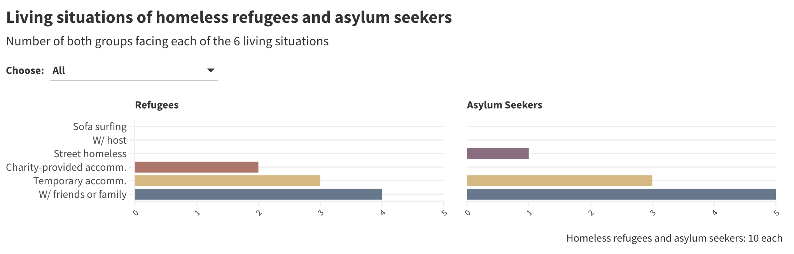

# Quantitative Analysis: Data Dashboard

- Quantitative survey data analysis using R (trends/patterns, transformations, addressed pivotal questions) to assist RootsMove CIC as part of the Data First Aid Service (Pro Bono) in addressing homelessness in the U.K.

- [Dashboard](https://public.flourish.studio/story/2280876/) with all interactive visualisations, charts, and key insights

